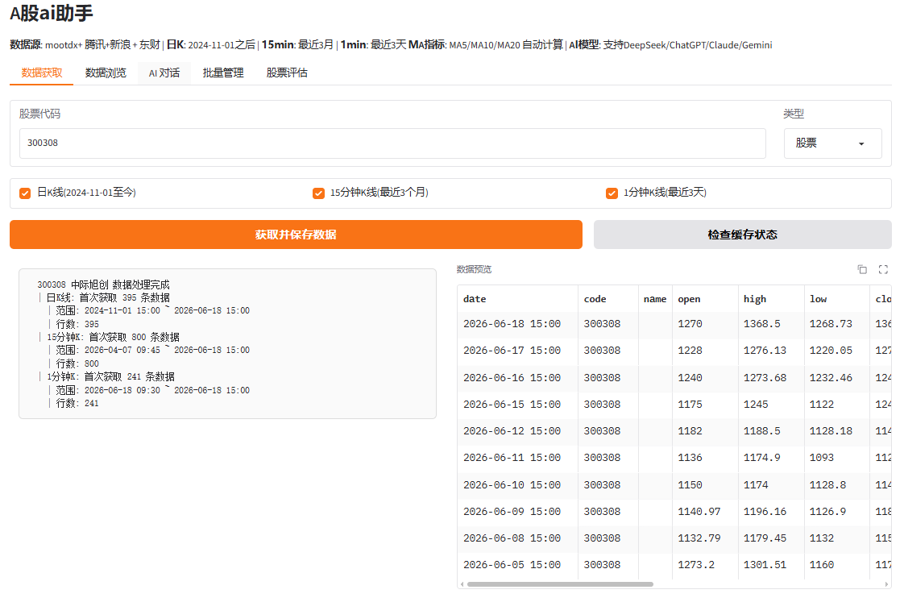
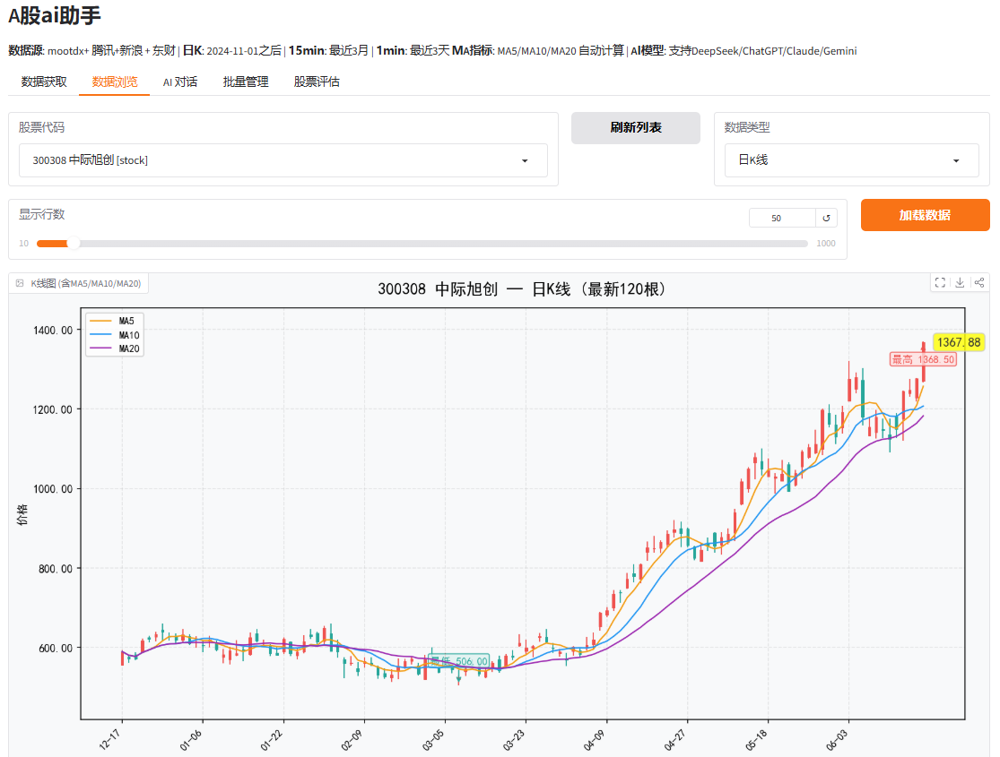
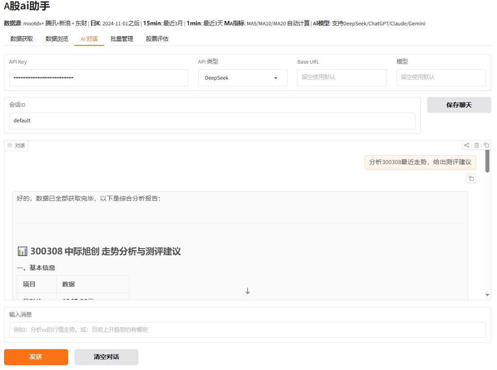

# A股ai助手

获取A股股票K线、数据管理保存可视化、股票趋势评估、AI 对话分析等。

## 功能

- **数据获取**：通过mootdx、腾讯、新浪、东方财富等数据源获取K线数据（日K/15分钟/1分钟线）
- **数据管理**：本地保存，UI显示含 MA5/MA10/MA20 均线的K 线图
- **AI 对话**：支持 DeepSeek / ChatGPT / Claude / Gemini 多模型，对话可自动调用工具函数获取实时数据。
- **趋势评估**：基于均线排列、价格位置、趋势斜率的纯程序化趋势判断，上升、震荡、下降趋势。


## 安装

```bash
# 克隆项目
git clone https://github.com/yourusername/stock_ai_assistant.git
cd stock_ai_assistant

# 安装依赖
pip install -r requirements.txt
```

## 使用
```
python main.py
```

启动后访问 http://127.0.0.1:7860

# API Key 配置

首次使用 AI 对话功能需要 API Key，在 "AI 对话" 标签页输入，支持：
- DeepSeek- ChatGPT- Claude- Gemini

## 数据获取：
输入股票代码，点击获取即可。如果是指数或场内ETF，选择对应类型。


## 数据浏览：
可查看已获取数据的K线图。


## AI对话：
接入AI后，可读取本地已保存数据，通过AI大模型进行分析；也可调用程序的数据获取功能。
如分析某只股票的行情、趋势等都可以直接通过对话进行。


## 股票评估：
批量评估已下载的股票处于趋势上升、震荡、趋势下降。也可对某只股票进行单独的详细评估。


